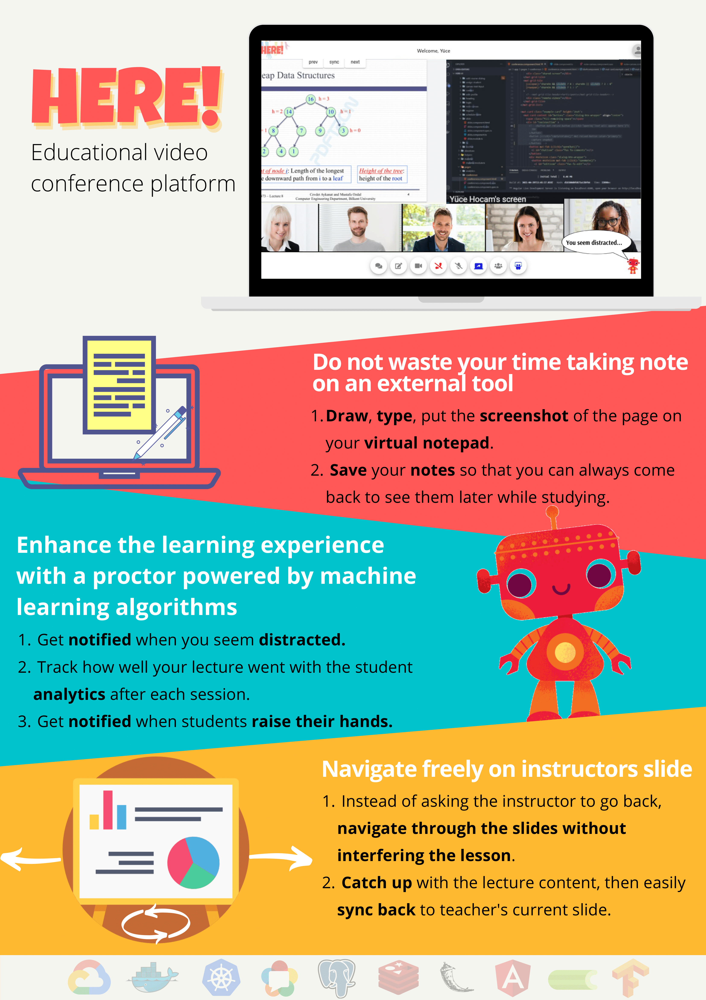

<!--
*** Thanks for checking out the Best-README-Template. If you have a suggestion
*** that would make this better, please fork the repo and create a pull request
*** or simply open an issue with the tag "enhancement".
*** Thanks again! Now go create something AMAZING! :D
-->

<!-- PROJECT SHIELDS -->
<!--
*** I'm using markdown "reference style" links for readability.
*** Reference links are enclosed in brackets [ ] instead of parentheses ( ).
*** See the bottom of this document for the declaration of the reference variables
*** for contributors-url, forks-url, etc. This is an optional, concise syntax you may use.
*** https://www.markdownguide.org/basic-syntax/#reference-style-links
-->
[![Contributors][contributors-shield]][contributors-url]
[![Modified][modified-shield]][modified-url]

<!-- PROJECT LOGO -->
 

  

  <h1 align="center">Here!</h3>

  <h3 align="center">
    Educational Video Conference Platform  
    Senior Design Project'21    
    Bilkent University CS Fair'21 Wide Impact Award Winner
     
     
    <a href="https://hereapp.live">View Demo</a>
    ·
    <a href="https://github.com/Ozanaydinn/Ozanaydinn.github.io/issues">Report Bug</a>
    ·
    <a href="https://github.com/Ozanaydinn/Ozanaydinn.github.io/issues">Request Feature</a>
  </h3>

<!-- ABOUT THE PROJECT -->
## About The Project

Here! is a video conference platform designed for educational needs of students and instructors. On top of the general characteristics of a video conferencing application, it includes additional practical educational tools. There is a virtual TA tool that uses motion tracking and object detection to analyze videos of students to generate summary information about the class attention, as well as to provide real time feedback to students and teachers. Other features are simultaneous note taking and slide-sharing. Note taking allows students to take notes and screenshots during the lecture and save them. Slide sharing allows students to navigate through the slides independently from the instructor, and then they can sync back with the instructor. Together, they make online education more reliable, informative and easy.

Our amazing features:
* AI Teaching Assistant: Teaching assistant is always there to keep students focused and notify instructors. It makes classes more interactive!
* Slide Sharing: Students can backtrack anytime on slides, no more "Sir, can you please go back two slides?"!
* Note Taking: Students can take notes during class on their own whiteboard. They can even draw on it!

### Built With

* [Flask](https://flask.palletsprojects.com/en/1.1.x/)
* [Angular](https://angular.io/)
* [WebRTC](https://webrtc.org/)
* [Docker](https://www.docker.com/)
* [Kubernetes](https://kubernetes.io/)
* [Google Cloud](https://cloud.google.com/)
* [PostgreSQL](https://www.postgresql.org/)
* [Redis](https://redis.io/)
* [Celery](https://docs.celeryproject.org/en/stable/)
* [Tensorflow](https://www.tensorflow.org/)
* [MediaPipe](https://github.com/google/mediapipe/)

<!-- USAGE EXAMPLES -->
## Usage

Watch Here!'s trailer [video](https://www.youtube.com/watch?v=pVwwyX-CRX0).

<!-- CONTRIBUTING -->
## Contributing

Contributions are what make the open source community such an amazing place to be learn, inspire, and create. Any contributions you make are **greatly appreciated**.

1. Fork the Project
2. Create your Feature Branch (`git checkout -b feature/AmazingFeature`)
3. Commit your Changes (`git commit -m 'Add some AmazingFeature'`)
4. Push to the Branch (`git push origin feature/AmazingFeature`)
5. Open a Pull Request

<!-- LICENSE -->
## License

Distributed under the MIT License. 

<!-- CONTACT -->
## Contact

You can find our contact information on [our website](https://hereapp.live).

  

<!-- MARKDOWN LINKS & IMAGES -->
<!-- https://www.markdownguide.org/basic-syntax/#reference-style-links -->
[contributors-shield]: https://img.shields.io/github/contributors/othneildrew/Best-README-Template.svg?style=for-the-badge
[contributors-url]: https://github.com/Ozanaydinn/Ozanaydinn.github.io/graphs/contributors
[modified-shield]: https://img.shields.io/github/last-commit/Ozanaydinn/Ozanaydinn.github.io?style=for-the-badge
[modified-url]: https://github.com/Ozanaydinn/Ozanaydinn.github.io

